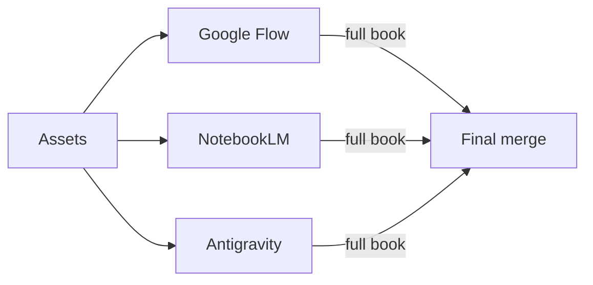

# GuangYaoYiLu · Joint Youth League Branch Showcase & Office Archive

[**中文说明**](README.md) · This page is in English.

> **Pharmacy (Sino-foreign) 2503 × Optoelectronics 2506 × Basic Medicine (Qiangji) 2501**

This repository archives the **deliverable showcase and office-style working materials** for the HUST «Guang Yao Yi Lu» joint youth league branch themed activity: multi-pipeline drafts and finals for an **A4 portrait summary book**, **defense / publicity PPTX** workflows with layered assets, posters, merch, and related research. It also ships a reusable, author-maintained **layered PPTX assembly Agent Skill** under [`skills/`](skills/).

## Contents

- Important notice · PPTX skill · Repository map · Subdirectory README index
- Narrative arc · Triple-pipeline workflow · Timeline · Deliverables
- Root helper files · Git & large files · Further reading · Licensing

## Important notice (rights & use)

- **The repository is public for reference; public visibility does not imply the branch’s creative content is licensed as open source.**
- **Except for files under [`skills/`](skills/) explicitly under the [Apache License 2.0](skills/LICENSE)** (see that file), text, designs, source materials, and deliverables are **not** granted by default for copying, redistribution, adaptation, or commercial use. Visitors may browse for **personal study and process/structure reference** only.
- Redistribution, derivative works, or commercial use require **written permission** from the branch and rights holders.

## PPTX layered skill (Apache-2.0)

**→ [skills index & setup](skills/README.en.md)** · Full license: [skills/LICENSE](skills/LICENSE)

Canonical package name: **`pptx-layer-merge`** (evolved/renamed from an earlier working title; **trust the current directory**).

## Repository map

| Path | Role |
|------|------|
| [`素材库/`](素材库/) | Source materials (some converted to Markdown), branding |
| [`总结书流水线/`](总结书流水线/) | Multi-channel full-book drafts (NotebookLM, Antigravity, CH01–CH15) |
| [`交付物/`](交付物/) | Defense PPT, “fast defense” layers & build scripts, posters, merch |
| [`输出终稿/`](输出终稿/) | Chosen finals for the summary book (folder may be absent locally or on remote depending on `.gitignore` / uploads) |
| [`工具/`](工具/) | Python / PowerShell helpers (see [`工具/README.en.md`](工具/README.en.md)) |
| [`逐字稿/`](逐字稿/) | Speaker scripts aligned with summary-book chapters |
| [`调研报告/`](调研报告/) | Research notes (PPT layering, package issues, tools & skills) |
| [`skills/pptx-layer-merge/`](skills/pptx-layer-merge/) | **Apache-2.0**: manifest assembly, validation scripts, specs |

### `交付物/` layout (summary)

| Subpath | Role |
|---------|------|
| `答辩PPT/` | Multiple defense deck versions (v1–v6, etc.), scripts, layers, previews |
| `快速答辩/` | Canonical full-slide composites plus `layers` for assembly workflows |
| `答辩PPT_legacy/` | Older single-slide experiments & prompts |
| `宣传/宣传海报/` | Poster pipelines & QA checks |
| `周边/瑶光文创/` | Merch-related deliverables |

Details: **[交付物/README.en.md](交付物/README.en.md)**.

> If a channel folder (e.g. Google Flow) is missing locally, ignore it; trust `总结书流水线/` and `输出终稿/` when present.

## Subdirectory README index

| Location | Chinese | English |
|----------|---------|---------|
| Repository root | [README.md](README.md) | [README.en.md](README.en.md) |
| Assets | [素材库/README.md](素材库/README.md) | key terms mirrored here |
| Pipelines | [总结书流水线/README.md](总结书流水线/README.md) | [总结书流水线/README.en.md](总结书流水线/README.en.md) |
| Deliverables | [交付物/README.md](交付物/README.md) | [交付物/README.en.md](交付物/README.en.md) |
| Research | [调研报告/README.md](调研报告/README.md) | [调研报告/README.en.md](调研报告/README.en.md) |
| Tools | [工具/README.md](工具/README.md) | [工具/README.en.md](工具/README.en.md) |
| Scripts (speakers) | [逐字稿/README.md](逐字稿/README.md) | [逐字稿/README.en.md](逐字稿/README.en.md) |
| Skills | [skills/README.md](skills/README.md) | [skills/README.en.md](skills/README.en.md) |
| Deck v5 / v6 | [v5 README](交付物/答辩PPT/答辩PPT_v5/README.md) · [v6 image2-first](交付物/答辩PPT/答辩PPT_v6_image2_first/README.md) | |
| Legacy | [答辩PPT_legacy](交付物/答辩PPT_legacy/README.md) | |
| Final book export | [输出终稿 README.md](输出终稿/README.md) · [English](输出终稿/README.en.md) | |
| Merch | [瑶光文创 README](交付物/周边/瑶光文创/README.md) | |

## Narrative arc (summary book)

Growth across the activity cycle: ice-breaking (**white**), ideological & volunteer practice (**red**), TCM-themed practice (**green**)—from three classes to one collective story.

## Triple-pipeline workflow (summary book)

| Strength | Google Flow | NotebookLM | Antigravity |
|----------|:-----------:|:----------:|:-----------:|
| Poster layout | High | Low | Medium |
| Copy editing | Low | High | Medium |
| Character art | Medium | Low | High |
| Infographics / maps | Medium | Low | High |

## Timeline (extract)

| When | Milestone |
|------|-----------|
| Before noon 4/27 | First draft |
| 4/27 PM | Full chapters + merge |
| 4/28 AM | Proof + dynamic version |
| **4/28 5:00 PM** | **Submission deadline** |

## Deliverables (summary book)

| Item | Format | Priority |
|------|--------|----------|
| Static | PDF | Required |
| Dynamic | PPT / video / GIF | Strongly recommended |

## Root-level helper files

| File | Purpose |
|------|---------|
| [Plan.md](Plan.md) | Chapter plan, visual spec, fabrication checklist for the summary book |
| [paths.json](paths.json) | JSON list of key asset paths under `素材库/` for scripting |
| [detect_frames.py](detect_frames.py) | Helper to infer photo placeholder frames from full-slide previews (Pillow / NumPy); paired with [`交付物/快速答辩`](交付物/快速答辩) |

## Git & large files

[`.gitignore`](.gitignore) excludes some large artifacts (e.g. `*.pptx`, certain PDFs/video). **Remote tree may not mirror a full local workspace.**

## Further reading

- [Plan.md](Plan.md) — Design spec (Chinese)
- [素材库/README.md](素材库/README.md) — Asset tree (Chinese)
- [总结书流水线/README.en.md](总结书流水线/README.en.md) — Pipeline layout
- [输出终稿/README.en.md](输出终稿/README.en.md) · [中文](输出终稿/README.md) — Final export folder primer
- [交付物/README.en.md](交付物/README.en.md) — Deliverables overview
- [调研报告/README.en.md](调研报告/README.en.md) — Research index
- [工具/README.en.md](工具/README.en.md) — Scripts
- [逐字稿/README.en.md](逐字稿/README.en.md) — Script ↔ chapter map
- [skills/README.en.md](skills/README.en.md) — Agent skill docs

## Licensing

- **Branch materials (outside `skills/`):** not under a default open-source license; see **Important notice** above.
- **`skills/` subtree:** **Apache-2.0** per [`skills/LICENSE`](skills/LICENSE), **Copyright © 2026 AIMFllyYS（羽升）**.
