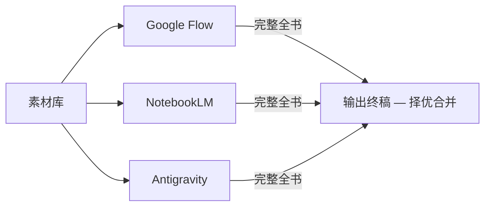

# 光药医路 · 联合团支部综合成果与办公文档

[**English**](README.en.md) · 本页为中文说明

> **药学（中外合作办学）2503 × 光电 2506 × 基础医学（强基计划实验班）2501**

本仓库为华中科技大学「光药医路」联合团支部特色团日活动的 **成品展示与综合办公文档归档**：含 **A4 竖版总结书** 的多渠道流水线草稿与终稿、**答辩/宣传类 PPTX** 与分层素材、海报与周边等。另包含作者自研、可复用的 **PPTX 分层组装 Agent Skill**（见 [`skills/`](skills/)）。

## 目录

- 重要声明（权利与使用范围）
- PPTX 分层技能（Apache-2.0）
- 仓库内容概览与子目录 README 索引
- 核心主旨与叙事线 · 三渠道工作流 · 答辩与总结书时间线 · 交付物
- 根目录杂项文件 · Git 与大文件 · 相关文档 · Licensing

## 重要声明（权利与使用范围）

- **本仓库为公开（public）参考用途，不代表团支部成品内容在开源许可下免费提供。**
- **除 [`skills/`](skills/) 目录下明确适用 [Apache License 2.0](skills/LICENSE) 的文件之外**，本仓库中的团支部文案、设计稿、素材与交付物等 **未默认授予** 复制、分发、改编或商业使用等权利；访问者仅可在 **个人学习、结构与流程参考** 的合理范围内浏览。
- 若需转载、演绎或商用，请另行取得 **联合团支部及权利人** 的书面许可。

## PPTX 分层技能（Apache-2.0）

为支撑高质量、可编辑答辩稿，本仓库维护自研技能包 **`pptx-layer-merge`**（由旧名演进更名，以当前目录为准）：

**→ [skills 说明与安装入口](skills/README.md)**（许可全文：[skills/LICENSE](skills/LICENSE)）

## 仓库内容概览

| 路径 | 说明 |
|------|------|
| [`素材库/`](素材库/) | 原始材料（部分已转 Markdown 便于阅读）、品牌资源等 |
| [`总结书流水线/`](总结书流水线/) | 多渠道「全书」草稿（NotebookLM、Antigravity 等，CH01～CH15） |
| [`交付物/`](交付物/) | 答辩 PPT、快速答辩分层与构建脚本、宣传海报、周边（瑶光文创）等 |
| [`输出终稿/`](输出终稿/) | 总结书择优定稿（若本地或远程未出现该目录，以实际归档为准） |
| [`工具/`](工具/) | Python / PowerShell 等辅助脚本（文档化程度与答辩 PPT 流水线相关） |
| [`逐字稿/`](逐字稿/) | 与总结书章节对应的口播/讲稿文本 |
| [`调研报告/`](调研报告/) | 制作过程中的调研与结论（含 PPT 分层、包损坏根因、工具与 Skills） |
| [`skills/pptx-layer-merge/`](skills/pptx-layer-merge/) | **开源许可（Apache-2.0）**：分层 manifest 组装、校验脚本与规范文档 |

### 交付物（`交付物/`）内部结构（摘要）

| 子路径 | 说明 |
|--------|------|
| `答辩PPT/` | 多版本答辩稿（v1～v6 等）、讲稿、分层与预览 |
| `快速答辩/` | 当前常用的全页底图 + `layers` 分层与组稿相关资源 |
| `答辩PPT_legacy/` | 历史单页实验、旧版 prompt 与目录说明 |
| `宣传/宣传海报/` | 宣传海报工程与质检说明 |
| `周边/瑶光文创/` | 文创类交付说明 |

详细说明见 **[交付物/README.md](交付物/README.md)**。

> 若本地未见 `Google Flow` 等目录，可忽略；以 `总结书流水线/` 与 `输出终稿/`（若存在）为准。

## 子目录 README 索引

| 位置 | 中文 | English |
|------|------|---------|
| 根目录 | [README.md](README.md) | [README.en.md](README.en.md) |
| 素材库 | [素材库/README.md](素材库/README.md) | （与素材说明同页，关键句可对照根目录英文） |
| 总结书流水线 | [总结书流水线/README.md](总结书流水线/README.md) | [总结书流水线/README.en.md](总结书流水线/README.en.md) |
| 交付物 | [交付物/README.md](交付物/README.md) | [交付物/README.en.md](交付物/README.en.md) |
| 调研报告 | [调研报告/README.md](调研报告/README.md) | [调研报告/README.en.md](调研报告/README.en.md) |
| 工具 | [工具/README.md](工具/README.md) | [工具/README.en.md](工具/README.en.md) |
| 逐字稿 | [逐字稿/README.md](逐字稿/README.md) | [逐字稿/README.en.md](逐字稿/README.en.md) |
| PPTX 技能 | [skills/README.md](skills/README.md) | [skills/README.en.md](skills/README.en.md) |
| 答辩 v5 / v6 | [答辩PPT_v5 README](交付物/答辩PPT/答辩PPT_v5/README.md) · [v6 image2-first](交付物/答辩PPT/答辩PPT_v6_image2_first/README.md) | |
| 历史实验 | [答辩PPT_legacy](交付物/答辩PPT_legacy/README.md) | |
| 总结书终稿目录 | [输出终稿 README](输出终稿/README.md) · [English](输出终稿/README.en.md) | |
| 周边 | [瑶光文创](交付物/周边/瑶光文创/README.md) | |

## 核心主旨与叙事线

**体现联合支部在整个特色团日活动期间的成长进步：** 从破冰相识（初识白）、思想与志愿实践（思政红），到中医药文化主线实践（药草绿），完成从「三个班」到「一个集体」的成长叙事。

## 三渠道工作流（总结书）

| 能力 | Google Flow | NotebookLM | Antigravity |
|------|:-----------:|:----------:|:-----------:|
| 海报排版 | 高 | 低 | 中 |
| 文案提炼 | 低 | 高 | 中 |
| 角色插画 | 中 | 低 | 高 |
| 信息图/地图 | 中 | 低 | 高 |

## 答辩 PPT 时间线（摘录）

| 时间 | 里程碑 |
|------|--------|
| **约 2026/05/08** | 答辩 PPT **初版**定稿截止 |
| **2026/05/10 当天约 13:00** | 答辩 PPT **最终版 v1**（可提交版）截止 |

## 总结书时间线（摘录，与特团全书提交节律一致）

| 时间 | 里程碑 |
|------|--------|
| 4/27 中午前 | 第一版初稿 |
| 4/27 下午～晚上 | 补全章节与三渠道择优 |
| 4/28 上午 | 终稿校对与动态版本 |
| **4/28 下午 5:00** | **总结书正式提交截止** |

## 交付物（总结书相关）

| 交付物 | 格式 | 优先级 |
|--------|------|--------|
| 静态版 | PDF | 必交 |
| 动态版 | PPT / 视频 / GIF | 强烈建议 |

## 根目录杂项文件

| 文件 | 说明 |
|------|------|
| [Plan.md](Plan.md) | 总结书章节规格、设计规范与产出清单（主编排文档） |
| [paths.json](paths.json) | 素材库关键文件路径列表（JSON，供脚本或排版引用） |
| [detect_frames.py](detect_frames.py) | 从「快速答辩」全页预览图中推断照片占位框的辅助脚本（依赖 Pillow / NumPy）；与 [`交付物/快速答辩`](交付物/快速答辩) 目录配合使用 |

## 与 Git 与大文件

根目录 [`.gitignore`](.gitignore) 会忽略部分大体积制品（例如 `*.pptx`、部分 PDF/视频）。**远程可见内容可能与本地完整工作目录不一致**；以各子目录说明与策划文档为准。

## 相关文档

- [Plan.md](Plan.md) — 章节规划与设计规范
- [素材库/README.md](素材库/README.md) — 素材目录说明
- [总结书流水线/README.md](总结书流水线/README.md) — 流水线结构说明
- [输出终稿/README.md](输出终稿/README.md) — 总结书定稿目录说明 · [English](输出终稿/README.en.md)
- [交付物/README.md](交付物/README.md) — 答辩与宣传交付总览
- [调研报告/README.md](调研报告/README.md) — 调研文集索引
- [工具/README.md](工具/README.md) — 脚本清单
- [逐字稿/README.md](逐字稿/README.md) — 章节与讲稿对照
- [skills/README.md](skills/README.md) — PPTX Skill 说明（中英分文件）

## Licensing

- **团支部相关材料与主仓库内容**：默认 **不** 以开源许可证授权；见上文「重要声明」。
- **`skills/` 子树**（以 [`skills/LICENSE`](skills/LICENSE) 为准）：**Apache License 2.0**，版权：**AIMFllyYS（羽升）**，2026。
