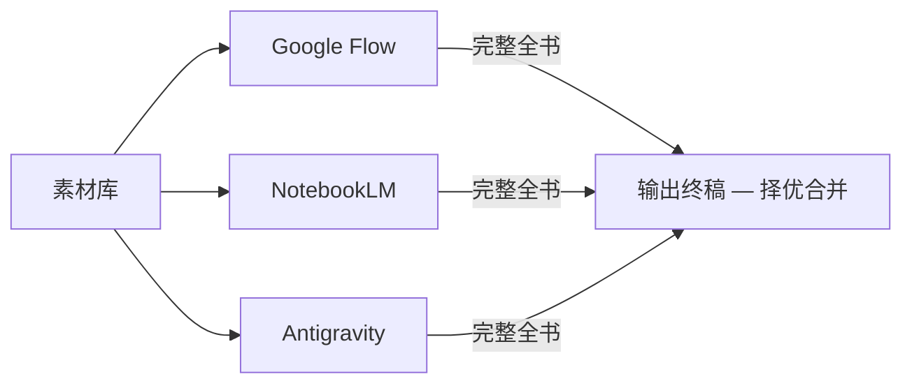

# 🎨 HUST-"光药医路"联合团支部 · 特色团日活动总结书

> **药学（中外合作办学）2503 × 光电2506 × 基础医学（强基计划实验班）2501**

联合团支部特色团日活动总结书制作项目。采用三条AI流水线并行产出完整全书，最终逐页择优合并，输出一本 **A4竖版海报绘本**。

## 📌 核心主旨

**体现联合支部在整个特色团日活动期间的成长进步。**

三个不同专业的团支部，因团组织联结在一起，从破冰相识（白）到思想淬炼（红），再到以中医药文化为主线的深度实践（绿），完成了从"三个班"到"一个集体"的成长蜕变。

### 叙事主线 —— 三色成长弧

- 🤍 **初识白** — 破冰相识，三个专业从陌生到熟悉
- ❤️ **思政红** — 团课学习 + 社区志愿，铸就青年担当
- 💚 **药草绿** — 嘉年华路演 + 冬暖青日考察 + 叶开泰博物馆，探索中医药文化

## 🗂️ 项目结构

```
总结书材料/
├── 素材库/           ← 所有原始材料（文档/PPT/照片/视频，内的docx与pdf均已无损转为md供AI读取）
│   ├── 01通知文件/
│   ├── 02总策划书/
│   ├── 03破冰活动/
│   ├── 04嘉年华/
│   ├── 05冬暖青日/
│   ├── 06三月活动/
│   ├── 07四月活动/
│   └── 08人员与合照/
│
├── Flow/             ← Google Flow 完整产出（CH01~CH15）
├── NotebookLM/       ← Google NotebookLM 完整产出（CH01~CH15）
├── Antigravity/      ← Antigravity AI 完整产出（CH01~CH15，含 brief.md）
│
├── 输出终稿/          ← 三渠道择优后的最终成品
├── 工具/              ← 辅助脚本（Python/PowerShell）
│
├── README.md          ← 本文件（项目总览）
└── Plan.md            ← 详细规划文档（章节规格/设计规范/产出要求）
```

> 📖 详细的章节规划、设计规范和逐章产出规格见 **[Plan.md](Plan.md)**

## ⚙️ 三渠道工作流



每个渠道**独立产出完整全书**（CH01封面 ~ CH15封底），最终逐页/逐章对比择优，汇入 `输出终稿/`。

| 能力 | Google Flow | NotebookLM | Antigravity |
|------|:-----------:|:----------:|:-----------:|
| 海报排版 | ⭐⭐⭐ | ⭐ | ⭐⭐ |
| 文案提炼 | ⭐ | ⭐⭐⭐ | ⭐⭐ |
| 角色插画 | ⭐⭐ | ⭐ | ⭐⭐⭐ |
| 信息图/地图 | ⭐⭐ | ⭐ | ⭐⭐⭐ |

## 📅 项目时间线

| 时间 | 里程碑 |
|------|--------|
| 4/27 中午前 | 第一版初稿 |
| 4/27 下午~晚上 | 补全所有章节 + 三渠道择优 |
| 4/28 上午 | 终稿校对 + 动态版本制作 |
| **4/28 下午 5:00** | 🔴 **正式提交截止** |

## 📦 交付物

| 交付物 | 格式 | 优先级 |
|-------|------|--------|
| 静态版 | PDF | 🔴 必交 |
| 动态版 | PPT / 视频 / GIF | 🟡 强烈建议 |

## 📚 相关文档

- [Plan.md](Plan.md) — 详细章节规划 & 产出规格
- [素材库/README.md](素材库/README.md) — 原始素材完整目录树
