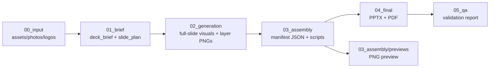

# pptx-layer-merge

[**中文**](README.md) · License: [Apache-2.0](LICENSE)

> Assemble editable, structurally healthy PPTX decks from layered manifests with multi-level validation.

---

## Overview

`pptx-layer-merge` is an **Agent Skill** that addresses:

- AI/Codex-generated PPTX files are often flagged as damaged by PowerPoint because hand-written OOXML lacks master/layout/theme parts.
- A single full-slide PNG as the only object is not editable; grid-based region slicing (header/left_field/…) is not PowerPoint element-level layering.
- There is no standardized contract layer between "visual design" and "deliverable PPTX."

This skill systematically solves these problems through a **manifest-driven pipeline** (asset ingestion → brief → visual generation → layer splitting → assembly → validation → delivery), outputting native editable PPTX + preview PNGs + validation reports.

## Status & Maturity

| Dimension | Status |
|-----------|--------|
| Spec documents | ✅ Stable (SKILL.md + 3 references) |
| Scripts | ✅ Usable (scaffold / build / validate) |
| Validation chain | ⚠️ Partial (package smoke + PIL + UTF-8; missing OpenXmlValidator + headless render) |
| End-to-end demo | ❌ No one-command smoke test yet |
| Animation support | ❌ Deferred by design (static first) |

Full gap list → [experience.en.md](experience.en.md)

## When to Use

**Use when:**

- You need to assemble **editable native PPTX** from AI-generated full-page visuals + real photos + logos
- You need a manifest as the contract between visual design and PPTX assembly
- You need multi-level validation (package → shape → visual → UTF-8)
- You need preview PNGs for visual QA without PowerPoint installed

**Do not use when:**

- You only need a screenshot/PDF, not an editable PPTX
- You already have a mature PowerPoint template + VBA macro pipeline
- You need complex animations/video embedding (not covered by this skill)

## Quick Start

```bash
# 1. Create workspace
python scripts/scaffold_pptx_project.py ./my-deck --title "Defense Deck" --slides 12

# 2. Write manifests (manually or Agent-generated) into 03_assembly/manifests/

# 3. Assemble + validate
python scripts/build_pptx_from_manifest.py ./my-deck \
  --manifest-dir 03_assembly/manifests \
  --out 04_final/pptx/deck.pptx \
  --preview-dir 03_assembly/previews \
  --expected-slides 12

python scripts/validate_pptx_artifact.py ./my-deck/04_final/pptx/deck.pptx \
  --expected-slides 12 --strict-final
```

Requirements: Python 3 + `python-pptx` + `Pillow`

## Architecture



## Scripts API

| Script | Purpose | Key Parameters | Output |
|--------|---------|----------------|--------|
| `scaffold_pptx_project.py` | Create standard workspace | `output_dir`, `--title`, `--slides`, `--ratio` | Directory structure + starter files |
| `build_pptx_from_manifest.py` | Assemble PPTX + preview from manifests | `workspace`, `--manifest-dir`, `--out`, `--preview-dir`, `--expected-slides` | `.pptx` + slide PNGs |
| `validate_pptx_artifact.py` | Multi-level PPTX validation | `pptx`, `--expected-slides`, `--scan-text-root`, `--strict-final` | JSON report (stdout) |

Scripts located at [`pptx-layer-merge/scripts/`](pptx-layer-merge/scripts/).

## Quality Gates

Validation is split into **Baseline Smoke** (package integrity) and **Final Strict** (delivery-grade):

- Baseline: ZIP CRC / required parts / relationships / media images / forbidden text / slide count
- Strict: master/layout/theme present / no external relationships / no single-image slides / native text exists

Full rules → [`references/quality-gates.md`](pptx-layer-merge/references/quality-gates.md)

## Compatibility

| Environment | Installation | Status |
|-------------|-------------|--------|
| **Cursor** | Place `pptx-layer-merge/` in Agent Skills directory with `SKILL.md` at root | ✅ Verified |
| **Codex CLI** | Point skill discovery at the directory containing `SKILL.md` | ✅ Verified |
| **Kiro / Generic CLI** | Same as Codex, follow tool's skill discovery rules | 🟡 Should work (untested) |
| **GitHub Actions** | Call scripts directly, no skill loader needed | ✅ Scripts run standalone |

## Roadmap & Known Gaps

7 unresolved gaps with commit evidence and candidate fixes → **[experience.en.md](experience.en.md)**

Near-term priorities:
1. End-to-end smoke test script
2. `--template` for template injection
3. Cross-platform font fallback

## License

**Apache License 2.0** — Copyright **AIMFllyYS（羽升）**, 2026.

Full text: [`LICENSE`](LICENSE)

### Relationship to branch materials in this repo

Files under `skills/` are licensed separately under Apache-2.0. This **does not** open-source or grant reuse of deliverables under `交付物/`, `输出终稿/`, etc. See the notice in the root [README.en.md](../README.en.md).

## Links

| Resource | Path |
|----------|------|
| Primary skill document | [`pptx-layer-merge/SKILL.md`](pptx-layer-merge/SKILL.md) |
| Workspace contract | [`references/workspace-contract.md`](pptx-layer-merge/references/workspace-contract.md) |
| Quality gates | [`references/quality-gates.md`](pptx-layer-merge/references/quality-gates.md) |
| Project lessons | [`references/guangyaoyilu-lessons.md`](pptx-layer-merge/references/guangyaoyilu-lessons.md) |
| Technical experience | [`experience.md`](experience.md) · [`experience.en.md`](experience.en.md) |
| Repository root | [`../README.md`](../README.md) · [`../README.en.md`](../README.en.md) |
| Research reports | [`../调研报告/PPT生成与元素级分层/`](../调研报告/PPT生成与元素级分层/) |
