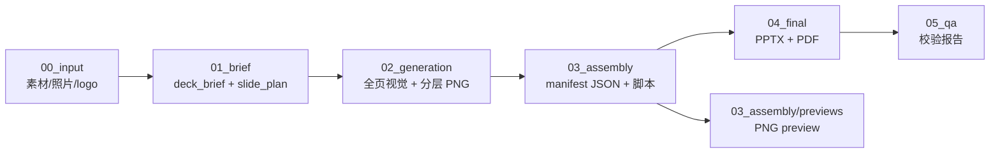

# pptx-layer-merge

[**English**](README.en.md) · 许可：[Apache-2.0](LICENSE)

> 从分层 manifest 组装可编辑、包结构健康的 PPTX 幻灯片，并做多层级校验。

---

## Overview

`pptx-layer-merge` 是一个 **Agent Skill**，解决以下问题：

- AI/Codex 生成的 PPTX 常因手写 OOXML 缺少 master/layout/theme 而被 PowerPoint 判定损坏。
- 整页 PNG 作为唯一对象无法编辑；按网格切片（header/left_field/…）不等于 PowerPoint 元素级分层。
- 缺乏从「视觉设计」到「可交付 PPTX」的标准化合约层。

本技能通过 **manifest-driven 流水线**（素材整理 → brief → 视觉生成 → 分层 → 组装 → 校验 → 交付）将这些问题系统性地解决，输出原生可编辑 PPTX + preview PNG + 校验报告。

## Status & Maturity

| 维度 | 状态 |
|------|------|
| 规范文档 | ✅ 稳定（SKILL.md + 3 references） |
| 脚本 | ✅ 可用（scaffold / build / validate） |
| 验证链 | ⚠️ 部分覆盖（package smoke + PIL + UTF-8；缺 OpenXmlValidator + headless render） |
| 端到端 demo | ❌ 尚无一键 smoke test |
| 动画支持 | ❌ 设计上延后（先静态后动画） |

详细困境清单 → [experience.md](experience.md)

## When to Use

**适用：**

- 需要从 AI 生成的全页视觉图 + 真实照片 + logo 组装出**可编辑原生 PPTX**
- 需要 manifest 作为视觉设计与 PPTX 组装之间的合约
- 需要多层级校验（package → shape → visual → UTF-8）
- 需要 preview PNG 在无 PowerPoint 环境下做视觉 QA

**不适用：**

- 只需要一张截图/PDF，不需要可编辑 PPTX
- 已有成熟 PowerPoint 模板 + VBA 宏流水线
- 需要复杂动画/视频嵌入（当前 skill 不覆盖）

## Quick Start

```bash
# 1. 创建工作区
python scripts/scaffold_pptx_project.py ./my-deck --title "项目答辩" --slides 12

# 2. 编写 manifest（手动或由 Agent 生成），放入 03_assembly/manifests/

# 3. 组装 + 校验
python scripts/build_pptx_from_manifest.py ./my-deck \
  --manifest-dir 03_assembly/manifests \
  --out 04_final/pptx/deck.pptx \
  --preview-dir 03_assembly/previews \
  --expected-slides 12

python scripts/validate_pptx_artifact.py ./my-deck/04_final/pptx/deck.pptx \
  --expected-slides 12 --strict-final
```

依赖：Python 3 + `python-pptx` + `Pillow`

## Architecture



## Scripts API

| 脚本 | 用途 | 关键参数 | 输出 |
|------|------|----------|------|
| `scaffold_pptx_project.py` | 创建标准工作区 | `output_dir`, `--title`, `--slides`, `--ratio` | 目录结构 + starter 文件 |
| `build_pptx_from_manifest.py` | 从 manifest 组装 PPTX + preview | `workspace`, `--manifest-dir`, `--out`, `--preview-dir`, `--expected-slides` | `.pptx` + slide PNG |
| `validate_pptx_artifact.py` | 多层级 PPTX 校验 | `pptx`, `--expected-slides`, `--scan-text-root`, `--strict-final` | JSON 报告（stdout） |

脚本位于 [`pptx-layer-merge/scripts/`](pptx-layer-merge/scripts/)。

## Quality Gates

校验分为 **Baseline Smoke**（包完整性）和 **Final Strict**（交付级）两档：

- Baseline：ZIP CRC / 必要 part / relationship / 媒体图片 / forbidden text / slide 数量
- Strict：master/layout/theme 存在 / 无外部 relationship / 非单图 slide / native text 存在

完整规则 → [`references/quality-gates.md`](pptx-layer-merge/references/quality-gates.md)

## Compatibility

| 环境 | 安装方式 | 状态 |
|------|----------|------|
| **Cursor** | 将 `pptx-layer-merge/` 放入 Agent Skills 目录，确保 `SKILL.md` 在根 | ✅ 已验证 |
| **Codex CLI** | 指向包含 `SKILL.md` 的目录 | ✅ 已验证 |
| **Kiro / 通用 CLI** | 同 Codex，按工具的 skill discovery 规则配置 | 🟡 应可用（未实测） |
| **GitHub Actions** | 脚本直接调用，无需 skill loader | ✅ 脚本独立可运行 |

## Roadmap & Known Gaps

当前 7 项未闭环困境（含 commit 证据与候选解法）→ **[experience.md](experience.md)**

近期优先：
1. 端到端 smoke test 脚本
2. `--template` 模板母体注入
3. 跨平台字体 fallback

## License

**Apache License 2.0** — 版权：**AIMFllyYS（羽升）**，2026。

许可全文：[`LICENSE`](LICENSE)

### 与本仓库团支部成品的关系

`skills/` 下的脚本与文档以 Apache-2.0 单独授权。这**不等于**仓库内 `交付物/`、`输出终稿/` 等团支部内容开放源码或开放重用。详见根目录 [README.md](../README.md) 的权利声明。

## Links

| 资源 | 路径 |
|------|------|
| 技能主文档 | [`pptx-layer-merge/SKILL.md`](pptx-layer-merge/SKILL.md) |
| 工作区约定 | [`references/workspace-contract.md`](pptx-layer-merge/references/workspace-contract.md) |
| 质检门槛 | [`references/quality-gates.md`](pptx-layer-merge/references/quality-gates.md) |
| 项目经验 | [`references/guangyaoyilu-lessons.md`](pptx-layer-merge/references/guangyaoyilu-lessons.md) |
| 技术沉淀 | [`experience.md`](experience.md) · [`experience.en.md`](experience.en.md) |
| 仓库首页 | [`../README.md`](../README.md) · [`../README.en.md`](../README.en.md) |
| 调研报告 | [`../调研报告/PPT生成与元素级分层/`](../调研报告/PPT生成与元素级分层/) |
